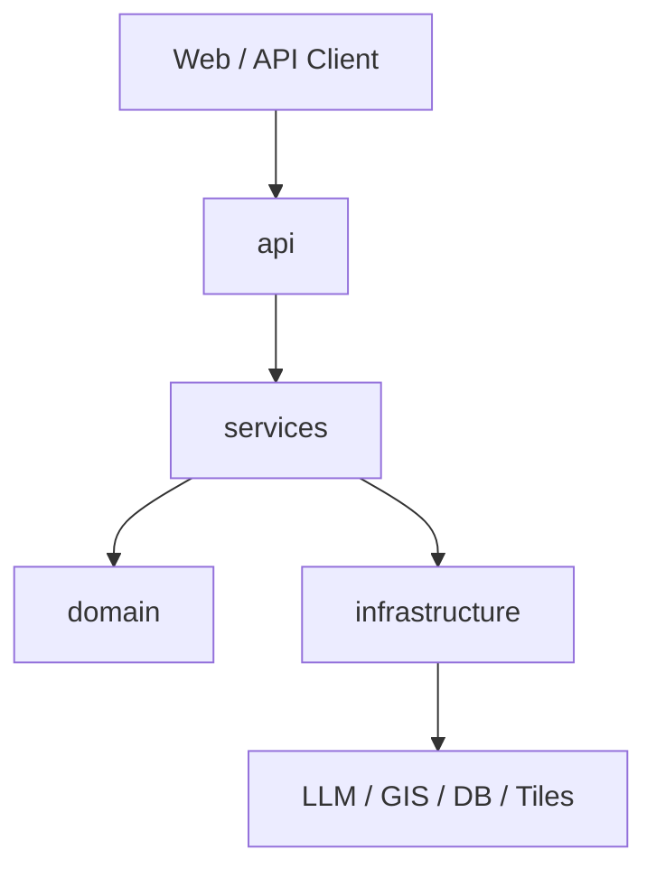

# 架构说明

## 总体分层

## 分层职责

- `domain`
  - 定义地图智能体的核心对象、意图、工具调用结果、空间查询结果
  - 保持纯业务，不依赖具体框架
- `services`
  - 编排一次请求需要调用哪些领域能力和外部能力
  - 负责把自然语言请求转换为地图任务
- `infrastructure`
  - 封装大模型、GIS 数据源、地图服务、向量库、数据库等外部依赖
  - 未来可替换不同厂商实现
- `api`
  - 提供 HTTP 接口
  - 负责参数校验、响应封装与错误映射
- `core`
  - 配置、日志、异常、依赖注入等通用基础设施

## 核心能力路线

1. 意图识别
2. 地理信息检索
3. 地图图层组织
4. 空间分析
5. 结果解释与可视化返回

